### Computer Vision 2025

# Analysing archer's body posture with Motion Capture System

The repository for the project of the course Computer Vision [[140266](https://unitn.coursecatalogue.cineca.it/insegnamenti/2024/50540_644803_89473/2011/50540/10117?annoOrdinamento=2011)] at University of Trento. This project used OptiTrack motion capture system to analyse the body posture of the archer to detect wrong body posture during the aiming phase with purpose to improve the shooting and prevent from injuries caused by wrong body posture.

## Installation & Run

```bash
# Clone the Repository
git clone https://github.com/yesunerdene9/computer-vision.git
```

```bash
# Navigate to the project root
cd computer-vision
```

```bash
# Install Dependencies
pip install -r requirements.txt
```

#### Run the project

```bash
# Please, make sure you have Python 3 and pip
python3 main.py
```

# What does the project do?

# Data collection

Following are the aiming phase of the archer, including the correct and wrong body postures

| <div style="text-align: center">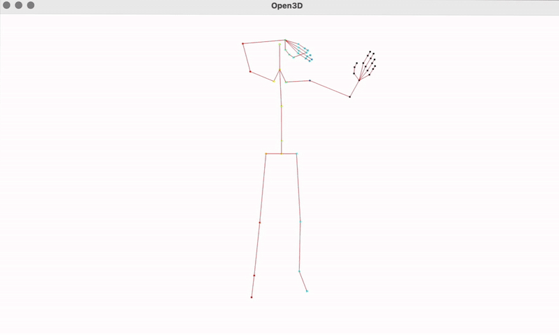<br/>Correct Body Posture</div> | <div style="text-align: center">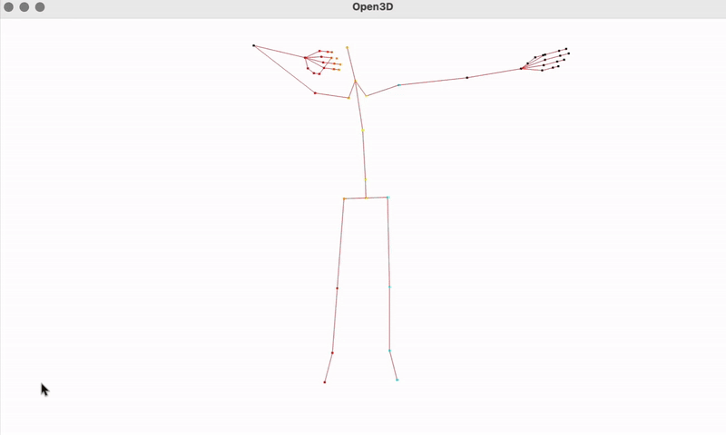<br/>Correct Body Posture in 3D</div> |
|------------------------------------------------------------------------------------------|------------------------------------------------------------------------------------------|


| <div style="text-align: center">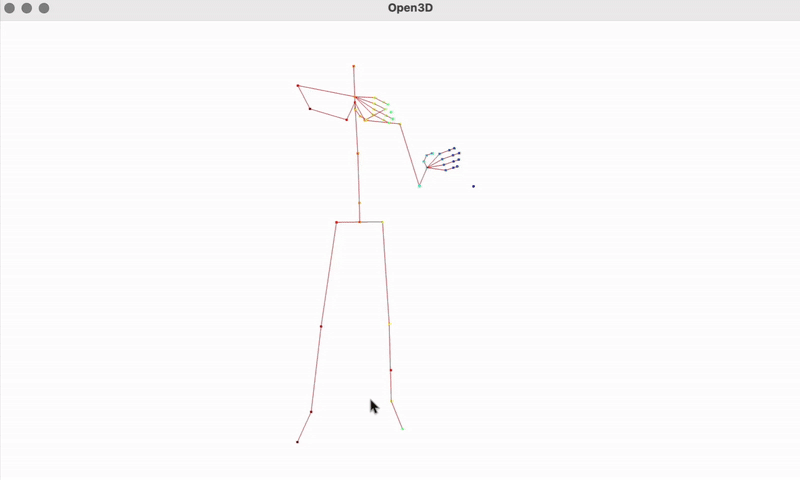<br/>Wrong Hips Posture tilt to the Left</div>  | <div style="text-align: center">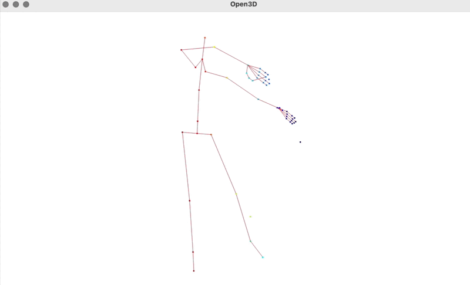<br/>Wrong Hips Posture Tilt to the Right</div> |
|------------------------------------------------------------------------------------------|------------------------------------------------------------------------------------------|


| <div style="text-align: center">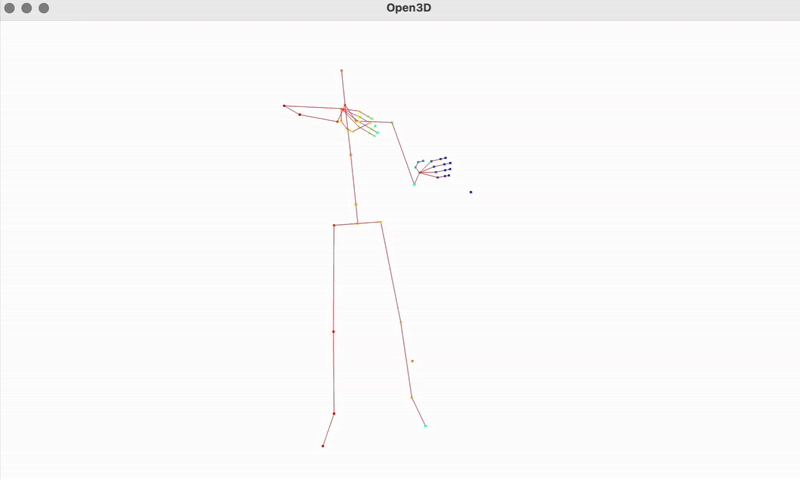<br/>Wrong Shoulder Raise Posture</div> |<div style="text-align: center">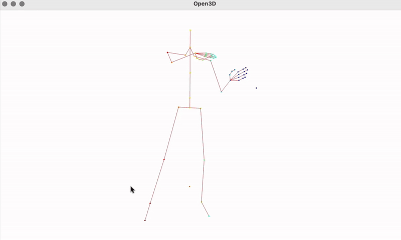<br/>Wrong Distance between posture</div> |
|------------------------------------------------------------------------------------------|------------------------------------------------------------------------------------------|


<!-- 
|  |  |  |  |
|-----------------------------------------|------------------------------------------|----------------------------------------------|------------------------------------------| -->


## Results

| <div style="text-align: center">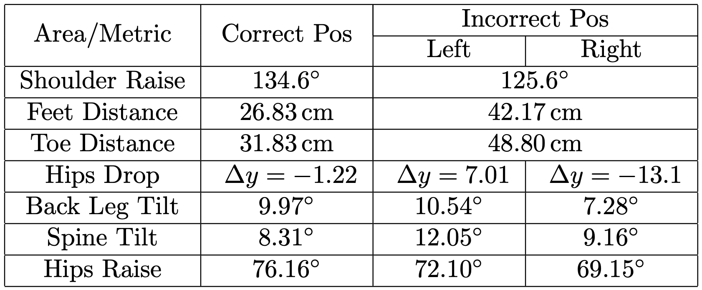<br/>The result of the analysis highlights the <br/>significant difference between the reference correct and incorrect body postures</div> |
|------------------------------------------------------------------------------------------|


| <div style="text-align: center">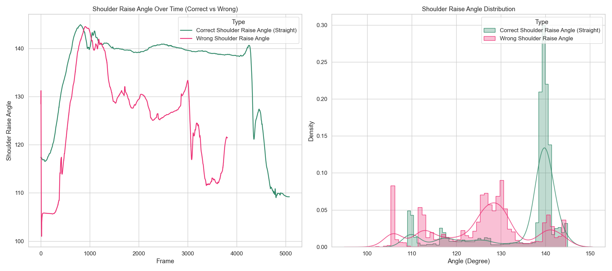<br/>Shoulder Raise Angle comparison</div> |
|------------------------------------------------------------------------------------------|

| <div style="text-align: center">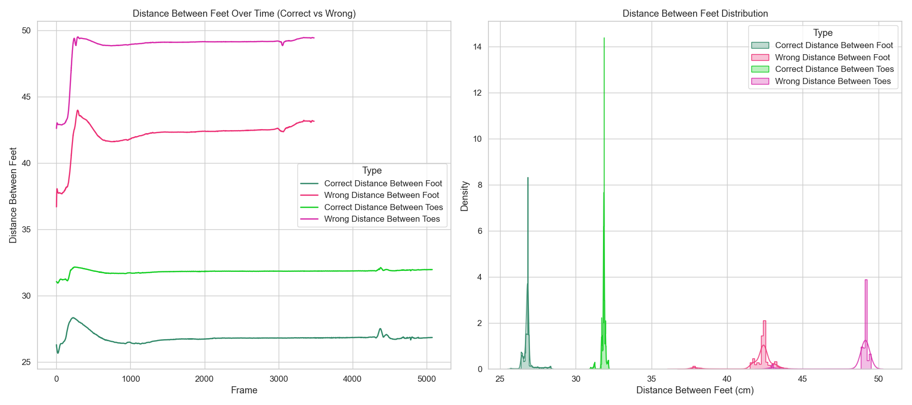<br/>Feet Distance comparison</div> |
|------------------------------------------------------------------------------------------|

| <div style="text-align: center">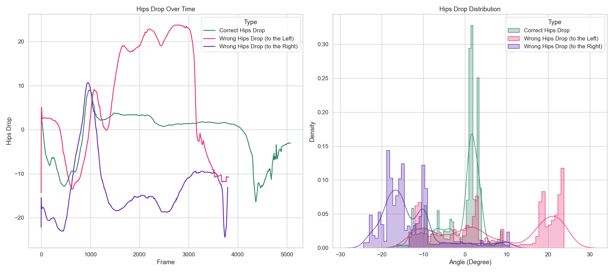<br/>Hips Drop comparison</div> |
|------------------------------------------------------------------------------------------|

| <div style="text-align: center">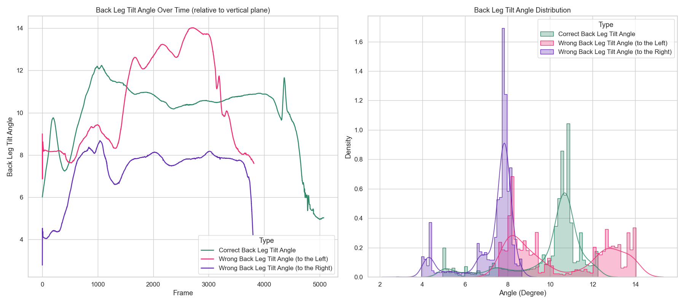<br/>Back Leg Tilt Angle comparison</div> |
|------------------------------------------------------------------------------------------|

| <div style="text-align: center">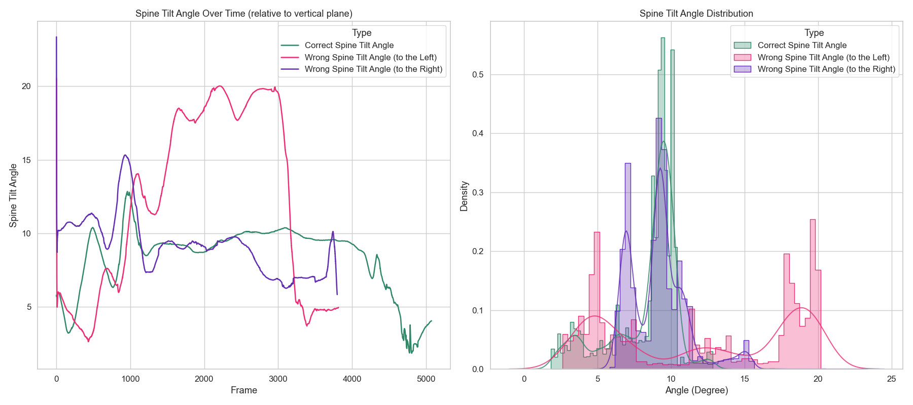<br/>Spine Tilt Angle comparison</div> |
|------------------------------------------------------------------------------------------|

| <div style="text-align: center">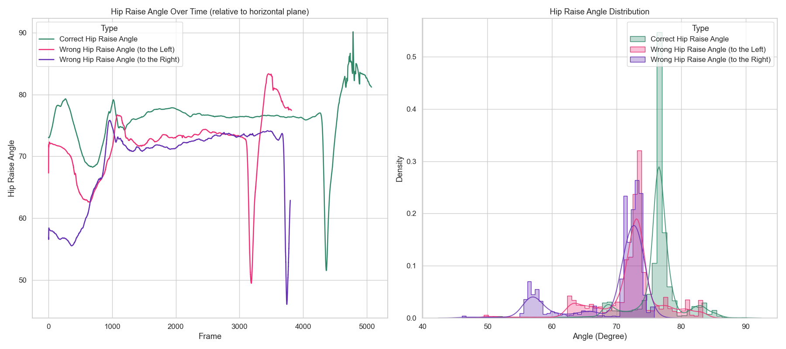<br/>Hips Raise Angle comparison</div> |
|------------------------------------------------------------------------------------------|


