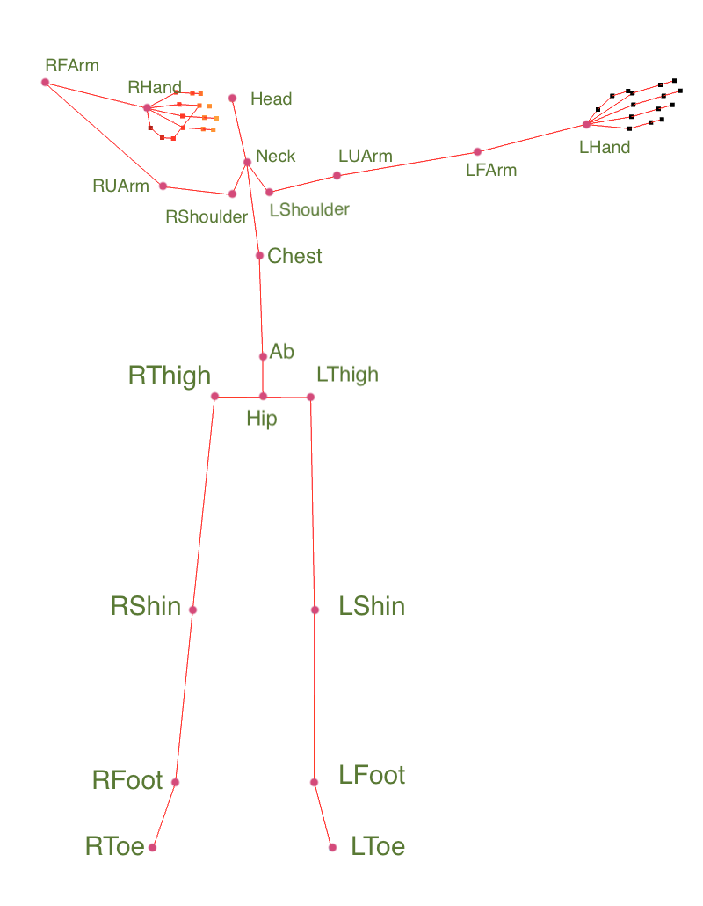
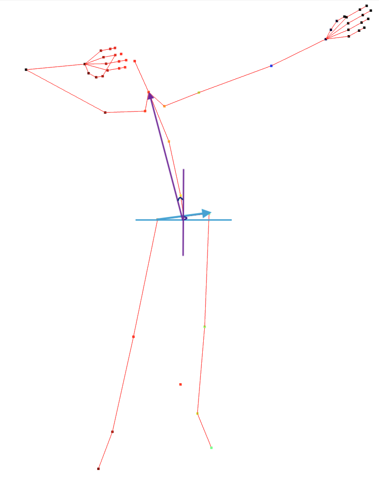
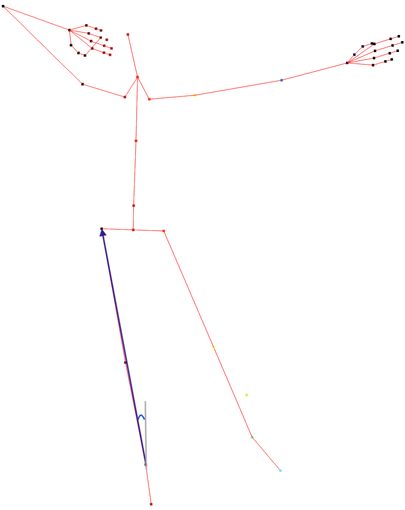

### Computer Vision 2025

# Analysing archer's body posture with Motion Capture System

The repository for the project of the course Computer Vision [[140266](https://unitn.coursecatalogue.cineca.it/insegnamenti/2024/50540_644803_89473/2011/50540/10117?annoOrdinamento=2011)] at University of Trento. 

This project analyses the fundamental body posture of an archer using MoCap technology to capture key postural parameters such as joint angles and foot distances. The aim is to provide insights that could lead to an automatic method for evaluating posture and classifying it as proper or incorrect in future work. The result of the analysis highlights a significant difference between the reference correct and incorrect body postures, showing the potential for objective classification based on measurable postural features.

The presentation video can be found [HERE](https://www.youtube.com/watch?v=LigHnNiQJhU)

## Installation & Run

```bash
# Clone the Repository
git clone https://github.com/yesunerdene9/computer-vision.git
```

```bash
# Navigate to the project root
cd computer-vision
```

```bash
# Install Dependencies
pip install -r requirements.txt
```

#### Run the project

```bash
# Please, make sure you have Python 3 and pip
python3 main.py
```

# Implementation

## Data collection

The following images show the aiming phase of the archer, including both correct and incorrect body postures.

| <div style="text-align: center"><br/>Correct Body Posture</div> | <div style="text-align: center"><br/>Correct Body Posture in 3D</div> |
|------------------------------------------------------------------------------------------|------------------------------------------------------------------------------------------|


| <div style="text-align: center"><br/>Wrong Hips Posture tilt to the Left</div>  | <div style="text-align: center"><br/>Wrong Hips Posture Tilt to the Right</div> |
|------------------------------------------------------------------------------------------|------------------------------------------------------------------------------------------|


| <div style="text-align: center"><br/>Wrong Shoulder Raise Posture</div> |<div style="text-align: center"><br/>Wrong Distance between posture</div> |
|------------------------------------------------------------------------------------------|------------------------------------------------------------------------------------------|


<!-- 
|  |  |  |  |
|-----------------------------------------|------------------------------------------|----------------------------------------------|------------------------------------------| -->

## Method
| <div style="text-align: center"><br/>Joints Marked with Points</div> |
|------------------------------------------------------------------------------------------|

| <div style="text-align: center"><br/>Spine and Hips raising Angle</div> | <div style="text-align: center"><br/>Leg Tilting Angle</div> |
|------------------------------------------------------------------------------------------|------------------------------------------------------------------------------------------|

| <div style="text-align: center"><br/>Shoulder Angle</div> | <div style="text-align: center"><br/>Distance Between Feet and Toes </div> |
|------------------------------------------------------------------------------------------|------------------------------------------------------------------------------------------|


## Results

<p align="center">
  
</p>
<p align="center">
  The result of the analysis highlights the <br/>
  significant difference between the reference correct and incorrect body postures.
</p>


### Output

The resulting output is organized in following structure:

```bash
output/
├── feet/
│   ├── plots/
│   │   ├── plot1.png
│   │   └── report.pdf
│   ├── stats/
│   │   ├── plot1.png
│   │   └── plot2.png
│   └── ...
├── hips/
│   └── hips_drop/
│   └── hips_raise/
│   └── leg_tilt/
│   └── spine_tilt/
│   │   ├── ...
│   │   ├── ...
├── shoulder/
│   ├── ...
```

---


| <div style="text-align: center"><br/>Shoulder Raise Angle comparison</div> |
|------------------------------------------------------------------------------------------|

| <div style="text-align: center"><br/>Feet Distance comparison</div> |
|------------------------------------------------------------------------------------------|

| <div style="text-align: center"><br/>Hips Drop comparison</div> |
|------------------------------------------------------------------------------------------|

| <div style="text-align: center"><br/>Back Leg Tilt Angle comparison</div> |
|------------------------------------------------------------------------------------------|

| <div style="text-align: center"><br/>Spine Tilt Angle comparison</div> |
|------------------------------------------------------------------------------------------|

| <div style="text-align: center"><br/>Hips Raise Angle comparison</div> |
|------------------------------------------------------------------------------------------|


